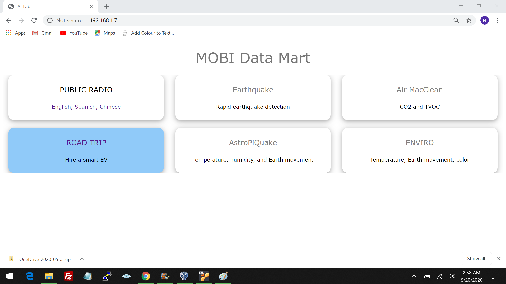
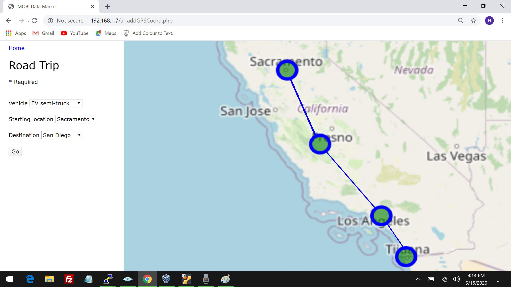
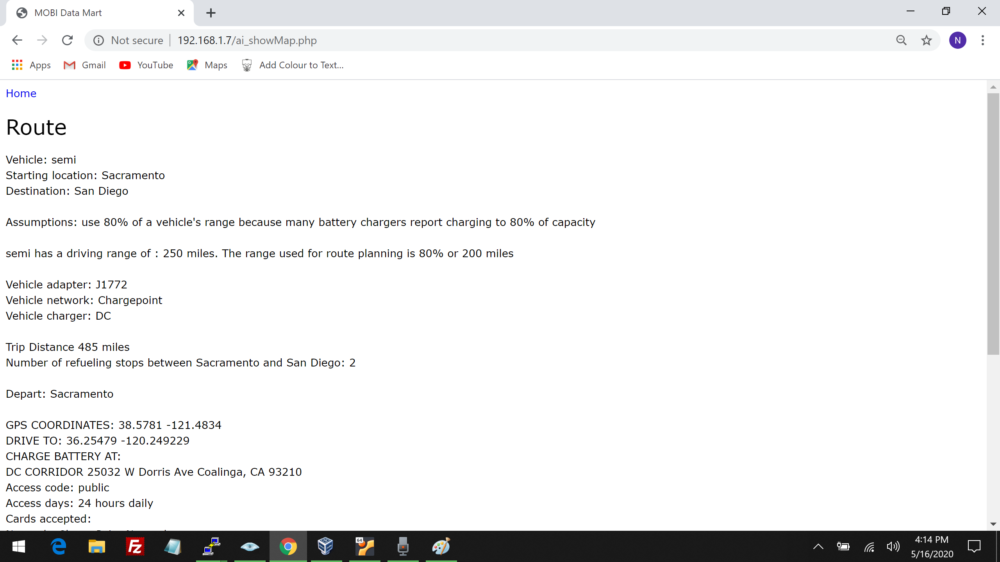

<h1>Creating a simple MOBI Data Mart web app</h1>

Copy ai.css, ai_addGPSCoord.php, ai_getGPSCoord.php, ai_getIP.php, and ai_showMap from the PHP folder into your /var/www/html folder

```


```



<h3>ai_addGPSCoord.php</h3>
ai_addGPSCoord.php creates a form with three drop down lists.  In this simple example, you can choose an economy car, a sports sedan, or a semi truck.  The vehicle can drive from Blaine, Washington to Los Angeles, Sacramento, or San Diego, California or any combination of these locations.  These drop down lists could be expanded to include any destination in the Station table.  ai_addGPSCoord.php calls ai_showMap.php  



<h3>ai_showMap.php</h3>
ai_showMap.php gets the vehicle, origin, and destination and inserts these into the goal table.  Using the Haversine method, it computes the distance between the GPS coordinates by calling a Python module named, ai_haversine.py.  It uses a minimum latitude of 32.665584 and a maximum latitude of 48.791487.  It gets the vehicle range, charging time, and adapter type from the KellyBlueBook table.  Most EV charging stations charge up to 80% of the vehicle's capacity so comforts stops are scheduled based on 80% of capacity.  Once the number of comfort stops has been computed, it updates the goal table.  Then, it finds the GPS coordinates for each stop and locates EV charging stations in the area.  It selects an EV charging station with the most high speed chargers.  Finally, it prints the route.     



<h3>ai_getGPSCoord.php</h3>
Bumblebee AV can emulate an economy car, sports sedan, or semi truck.  It uses ai_getGPSCoord.php to get the vehicle type and the number of fuel stops for each trip.

<h3>ai_getIP.php</h3>
Update ai_getIP.php with the MAC address of the computer running the MOBI Data Mart.  In this simple example, each device in the AI Lab will use this script to find the IP address it needs to connect to the data mart.  

