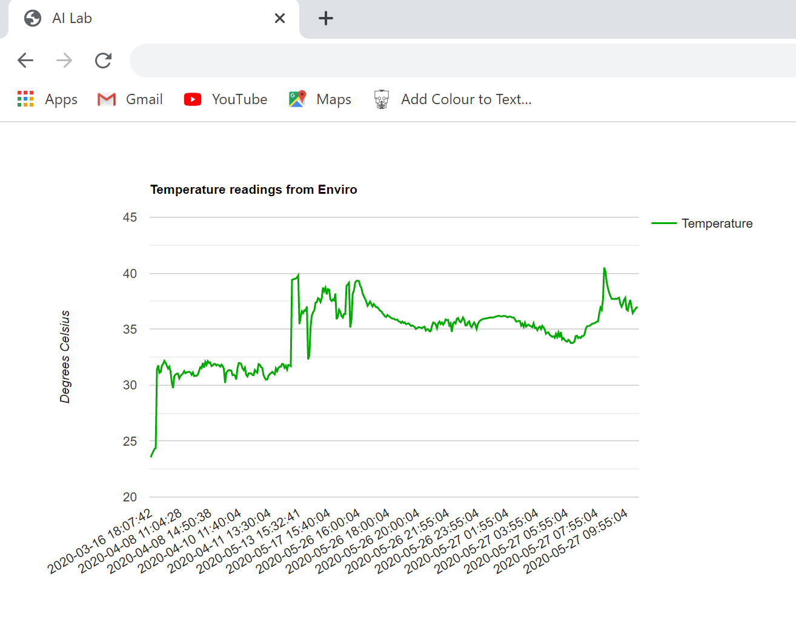

<h1>Using Google Charts to monitor temperature</h1>



```
<!DOCTYPE html>
<html>
  <head>
    <script type="text/javascript" src="https://www.gstatic.com/charts/loader.js"></script>
    <script type="text/javascript">
      google.charts.load('current', {'packages':['corechart']});
      google.charts.setOnLoadCallback(drawChart);

      function drawChart() {

        var data = google.visualization.arrayToDataTable([
            ['Date', 'Temperature'],

<?php
  require 'aiConn_ai_lab_data.php';
  $sql = "SELECT timestamp, temperature from enviro";
	$result = $conn->query($sql);

	if ($result->num_rows > 0) {
	    while($row = $result->fetch_assoc()) {
       		echo "['".$row["timestamp"]."', ".$row["temperature"]."],";

	    }
	} else {
	    echo "None";
	}
	$conn->close();
?>
       ]);
        var options = {
          series: {
              0: {color: '#00aa00'}},
          title: 'Temperature readings from Enviro',
       	  vAxis: {
		title: "Degrees Celsius"
		}
        };

        var chart = new google.visualization.LineChart(document.getElementById('tmpChart'));
        chart.draw(data, options);
      }
    </script>
  </head>
  <body>
    <div id="tmpChart" style="width: 100%; height: 500px;"></div>
  </body>
</html>
```
